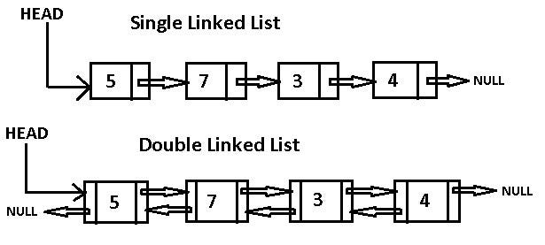

# Modul 2 - Struktur Data Linier: Linked List dan Variannya

## **Daftar Isi**

- [Linked List](#linked-list)
- [Double Linked List](#double-linked-list)
- [Circular Single Linked List](#circular-single-linked-list)
- [Circular Double Linked List](#circular-double-linked-list)

## **Linked List**

### **Terminologi**
Beberapa istilah yang akan sering digunakan dalam mendeskripsikan linked list:
- Node: Sebuah elemen data yang dapat berisikan suatu nilai atau informasi yang dibutuhkan serta pada setiap node mengandung pointer ke node selanjutnya.
- Head: Node pertama dari linked list.
- Tail: Node terakhir dari linked list.

### **Apa itu Linked List?**
Linked list adalah struktur data linear, di mana elemen tidak disimpan di lokasi memori yang berdekatan. Elemen-elemen pada lineked list ditautkan menggunakan pointer seperti gambar di bawah ini:


> Sumber Gambar : https://www.geeksforgeeks.org/what-is-linked-list/?ref=lbp

Sebuah node pada linked list terdiri atas:
- Data atau informasi yang disimpan.
- Referensi (tautan) ke node selanjutnya.

### **Linked List vs Array**
| No  | Linked List | Array |
|----|-------------|-------|
| 1  | Linked list tidak disimpan di lokasi memori yang berdekatan. | Array disimpan di lokasi memori yang berdekatan. |
| 2  | Ukurannya dinamis. | Ukurannya tetap. |
| 3  | Memori dialokasi pada run time. | Memori dialokasi pada compile time. |
| 4  | Menggunakan memori yang lebih banyak dibandingkan array karena menyimpan data dan referensi ke node selanjutnya. | Menggunakan memori yang lebih sedikit dibandingkan array. |
| 5  | Elemen membutuhkan traversal ke seluruh linked list. | Elemen dapat dengan mudah diakses. |
| 6  | Operasi insert dan delete membutuhkan waktu. | Operasi insert dan delete dilakukan dengan lebih cepat. |

### **Ilustrasi**
Linked list dapat diilustrasikan dengan beberapa node yang saling terhubung satu dengan yang lain sehingga membentuk rangkaian yang saling berurutan. Contohnya terdapat list A dengan beberapa kumpulan data A =[2,6,8,9,15].


### **Operasi Dasar**
- isEmpty Untuk memeriksa apakah list kosong atau tidak.
- pushBack <br />
Untuk menambahkan data baru dari belakang list. Untuk ilustrasinya terdapat pada gambar di bawah.


- pushFront <br />
Untuk menambahkan data baru dari depan list. Untuk ilustrasinya terdapat pada gambar di bawah.


- insertAt <br />
Untuk menambahkan data baru pada posisi yang diinginkan. Untuk ilustrasinya terdapat pada gambar di bawah.


- back Untuk mendapatkan data yang ada di paling belakang.
- front Untuk mendapatkan data yang ada di paling depan.
- getAt Untuk mendapatkan data pada posisi tertentu.

- popBack <br />
Untuk menghapus data yang berada di posisi paling belakang. Untuk ilustrasinya terdapat pada gambar di bawah.


- popFront <br />
Untuk menghapus data yang berada di posisi paling depan. Untuk ilustrasinya terdapat pada gambar di bawah.


- remove(x) <br />
  Untuk menghapus data x yang pertama muncul dalam list. Untuk ilustrasinya terdapat pada gambar di bawah.
  

### **Variasi Linked List**
- Singly-Linked List Setiap node memiliki data dan pointer ke node berikutnya. Untuk ilustrasinya terdapat pada gambar di bawah.
  
- Double-Linked List Terdapat penambahan pointer ke node sebelumnya dalam double-linked list. Sehingga dapat menuju pada node sebelumnya dan node selanjutnya. Dua tautan ini disebut dengan next dan prev. Untuk ilustrasinya terdapat pada gambar di bawah.
  
- Circular-Linked List Pada variasi ini elemen terakhir ditautkan ke elemen pertama. Ini membentuk lingkaran melingkar. Untuk ilustrasinya terdapat pada gambar di bawah.
  

### **Implementasi ADT: SinglyList**
Representasi dan Implementasi yang akan dijelaskan dalam modul ini adalah Singly Linked List yang menyimpan tipe data int. Representasi akan dibawa ke dalam bentuk Abstract Data Type (ADT) yang nantinya akan menjadi tipe data baru bernama SinglyList. <br />
Dalam implementasinya, kompleksitas waktunya yaitu:

| Operasi   | Keterangan                                      | Kompleksitas Waktu  |
|-----------|-----------------------------------------------|-----------------------|
| pushBack  | Memasukkan data baru dari belakang.           | O(N)                  |
| pushFront | Memasukkan data baru dari depan.              | O(1)                  |
| insertAt  | Memasukkan data baru pada posisi tertentu.    | O(N) (Worst-case)     |
| popBack   | Menghapus node paling belakang.               | O(N)                  |
| popFront  | Menghapus node paling depan.                  | O(1)                  |
| remove(x) | Menghapus node pertama dengan data x.         | O(N) (Worst-case)     |
| front     | Mendapatkan nilai node terdepan.              | O(1)                  |
| back      | Mendapatkan nilai node paling belakang.       | O(N)                  |
| getAt     | Mendapatkan nilai node pada posisi tertentu.  | O(N) (Worst-case)     |
| isEmpty   | Memeriksa apakah list kosong.                 | O(1)                  |


 [Kode Lengkap & Penjelasan Dapat Dilihat Disini](code/singlyList.cpp)  
 
## **Double Linked List**
Double linked list merupakan jenis linked list yang setiap node memiliki dua referensi: satu menunjuk ke node sebelumnya dan satu lagi menunjuk ke node berikutnya. Berbeda dengan single linked list yang hanya memiliki satu referensi yangg menunjuk ke node berikutnya. <br />
Struktur node ganda ini memungkinkan traversal dua arah; forward dan backward

 
> Sumber gambar : https://brianross-95869.medium.com/doubly-linked-lists-double-the-trouble-but-double-the-fun-1d13ed215dfe

### **Struktur Double Linked List***
Struktur node pada double linked list terdiri dari tiga komponen utama:
- Data: Komponen yang menyimpan nilai atau informasi yang disimpan dalam node.
- Pointer ke Node Sebelumnya: Referensi yang menunjuk ke node sebelumnya dalam linked list.
- Pointer ke Node Berikutnya: Referensi yang menunjuk ke node berikutnya dalam linked list.

### **Implementasi Dasar Double Linked List**
- Struktur node ganda dapat diimplementasikan sebagai berikut :
```cpp
class Node
{
    public:
    int data;
    Node *next; //menunjuk ke node berikut
    Node *prev; //menunjuk ke node sebelum
};
```

- Menambahkan Elemen di Awal
  
  > Langkah-langkahnya adalah sebagai berikut :
  > - Membuat node baru berisi data yang ingin ditambahkan
  > - Jika list kosong :
  >     - Ubah `newNode->next` menjadi `NULL`
  >     - Ubah `newNode->prev` menjadi `NULL`
  >     - Arahkan pointer `head` ke `newNode`
  > - Jika list tidak kosong :
  >     - Atur `newNode->next` ke `head`
  >     - Atur `newNode->prev` ke `NULL`
  >     - Atur `head->prev` ke `newNode`
  >     - Arahkan pointer `head` ke `newNode`
  
- Menambahkan Elemen di Akhir
  
  > Langkah-langkahnya adalah sebagai berikut :
  > - Membuat node baru `newNode`
  > - Jika list kosong :
  >     - Ubah `newNode->next` menjadi `NULL`
  >     - Ubah `newNode->prev` menjadi `NULL`
  >     - Arahkan pointer `head` ke `newNode`
  > - Jika list tidak kosong :
  >     - Temukan node terakhir dengan melakukan iterasi ( node dengan `last->next == NULL` )
  >     - Atur `last->next` ke `newNode`
  >     - Atur `newNode->next` menjadi `NULL`
  
- Menghapuskan Elemen di Awal
  
  > Langkah-langkah untuk menghapus node awal Double Linked List :
  > - Periksa apakah list kosong
  > - Jika list hanya memiliki satu node :
  >     - Atur `head` menjadi `NULL`
  >     - Hapus memori node tersebut
  > - Jika list memiliki > 1 node
  >     - Perbarui `head` dengan menunjuk ke `head->next`
  >     - Atur `prev` dari head baru ke `NULL`
  >     - Hapus memori `head` lama
  
- Menghapuskan Elemen di Akhir
   
  > Langkah-langkah untuk menghapus node akhir Double Linked List :
  > - Periksa apakah list kosong
  > - Jika list tidak kosong :
  >     - Temukan node terakhir dengan iterasi `last->next == NULL`
  >     - Jika node terakhir adalah node satu-satunya dalam list `head->next ==NULL`, perbarui `head` menjadi `NULL`
  >     - Jika lebih dari satu node, atur `next` dari node kedua terakhir (`last->prev`) menjadi `NULL`
  > - Hapus memori node terakhir
  
- Menyisipkan Elemen di posisi tertentu
   
  > Langkah-langkahnya adalah sebagai berikut :
  > - Membuat node baru `newNode`
  > - Cek apakah posisi node yang diberikan valid berdasarkan ukuran list
  > - Jika posisi adalah 0 (atau 1 tergantung index)
  >     - Terapkan penambahan elemen di awal
  > - Jika posisi yang diberikan adalah node terakhir (sama dengan ukuran list)
  >     - Terapkan penambahan elemen di akhir
  > - Untuk posisi valid lainnya :
  >     - Telusuri list untuk menemukan node sebelum posisi yang diinginkan `prevNode`
  >     - Atur `newNode->next` ke `prevNode->next
  >     - Atur `newNode->prev` ke `prevNode`
  >     - Jika `prevNode->next` tidak `NULL`, atur `prevNode->next->prev` ke `newNode`
  >     - Atur `prevNode->next` ke `newNode`

- Menghapuskan Elemen di posisi tertentu
   
  > Langkah-langkah untuk menghapus node dari posisi tertentu dalam Double Linked List :
  > - Jika posisi node yang diberikan adalah 0 (atau 1 tergantung index), gunakan metode penghapusan di awal
  > - Jika posisi yang diberikan merupakan node terakhir, gunakan metode penghapusan di akhir
  > - Untuk posisi valid lainnya :
  >     - Traversal untuk menemukan node yang akan dihapus `delNode`
  >     - Jika `delNode` adalah node pertama, sesuaikan `head`
  >     - Jika tidak, atur `delNode->prev->next` ke node setelah `delNode`(`delNode->next`) dan `delNode->next->prev` ke node sebelum `delNode`(`delNode->prev`)

### **Traversal dalam Double Linked List**
Traversal dalam double linked list berarti mengiterasi list dengan mengunjungi setiap node dan melakukan operasi yang diinginkan. <br />
- Forward Traversal : `head` ke node terakhir
- Reverse/Backward Traversal : node terakhir ke `head`

1. Forward Traversal
   > - Buat pointer sementara `temp` dan salin pointer head ke dalamnya `temp = head`.
   > - Untuk traversal maju, terus pindahkan `temp` ke `temp->next`
   > - Jalankan operasi yang diinginkan di setiap iterasi.
2. Backward Traversal
   > - Buat pointer sementara `temp` dan salin pointer node terakhir ke dalamnya `temp = tail`.
   > - Untuk traversal mundur, terus pindahkan pointer `temp` ke `temp->prev`
   > - Jalankan operasi yang diinginkan di setiap iterasi.

[Kode Lengkap & Penjelasan Dapat Dilihat Disini](code/doublyList.cpp)  

## Circular Single Linked List
Circular Single Linked List adalah jenis linked list di mana setiap node memiliki referensi ke node berikutnya, dan node terakhir mengarah kembali ke node pertama, membentuk lingkaran. Berbeda dengan single linked list biasa yang memiliki ujung akhir, circular single linked list tidak memiliki node yang menunjuk ke NULL.

###  Struktur Circular Single Linked List
Struktur node dalam circular single linked list terdiri dari dua komponen utama:
> - Data: Menyimpan nilai atau informasi dalam node.
> - Pointer ke Node Berikutnya: Menunjuk ke node berikutnya dalam linked list. Node terakhir menunjuk kembali ke node pertama.
 


### Perbedaan Utama dari Single Linked List Biasa

Penyisipan Elemen :
> - Jika disisipkan di awal, pointer next pada node terakhir harus diperbarui untuk merujuk ke head yang baru.
> - Berbeda dengan SLL standar yang hanya memodifikasi pointer head, CSLL membutuhkan langkah tambahan untuk mempertahankan struktur melingkar.
> - Untuk penyisipan di posisi lain, prosesnya hampir sama dengan SLL, kecuali bahwa traversal tidak berhenti pada NULL tetapi kembali ke head jika diperlukan.

Penghapusan Elemen :
> - Jika menghapus node head, pointer next pada node terakhir harus diperbarui untuk menunjuk ke head yang baru.
> - Berbeda dengan SLL, di mana penghapusan node terakhir cukup dengan mengatur pointer next dari node sebelumnya menjadi NULL, dalam CSLL node terakhir harus tetap terhubung ke head.
> - Jika menghapus node di posisi tertentu, traversal mengikuti logika yang sama dengan SLL tetapi tetap dalam referensi melingkar.

Traversal Elemen :
> - Traversal dalam CSLL berbeda secara signifikan dari SLL karena tidak adanya terminasi NULL
> - Kondisi terminasi harus didefinisikan secara eksplisit, biasanya ketika traversal kembali ke node head.
> - Traversal maju akan kembali ke head, yang dapat menyebabkan loop tak terbatas jika tidak ditangani dengan benar.


