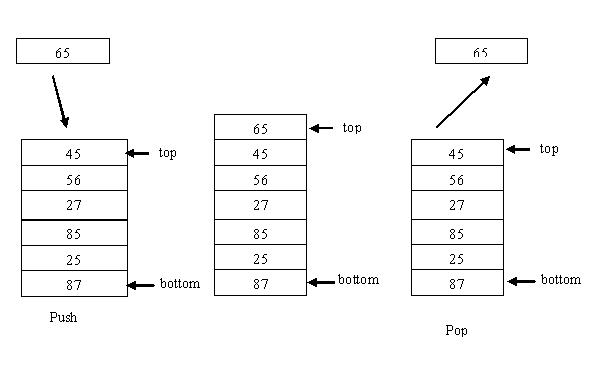
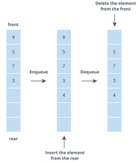
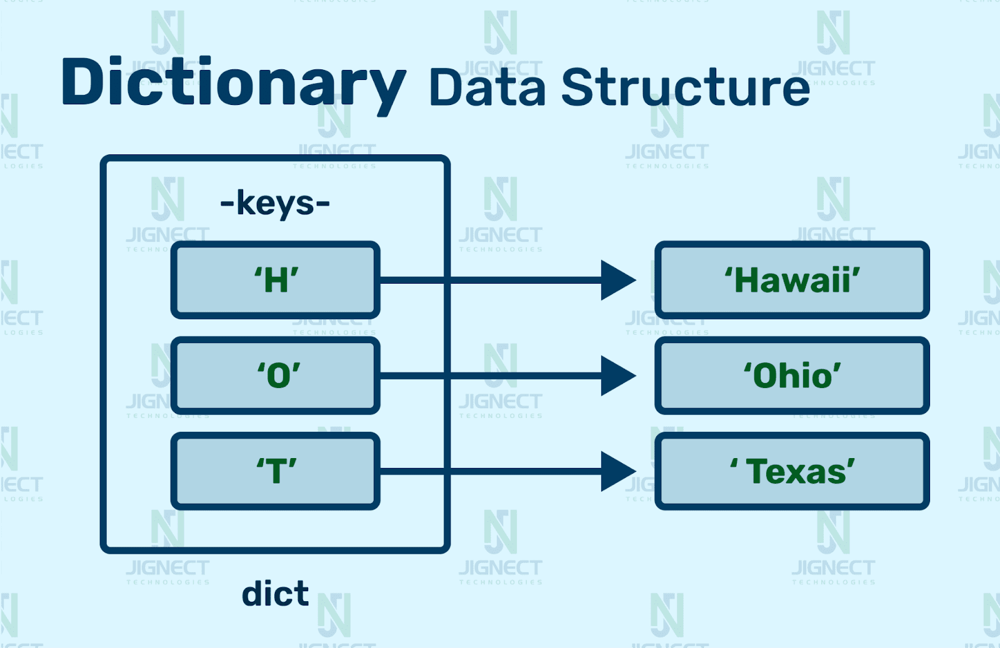
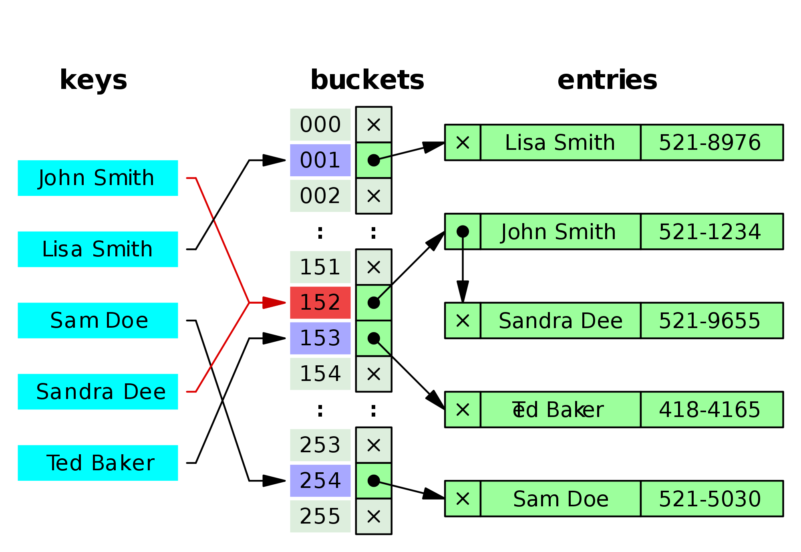

# Modul 3 - Struktur Data Dasar: Stack, Queue, Dictionary, dan Hashing

## <b>Daftar Isi</b>
- [Stack](#stack)
- [Queue](#queue)
- [Deque](#deque)
- [Priority Queue](#priority-queue)
- [Dictionary](#dictionary)
- [Hashing](#hashing)


## <b>Stack</b>
<a name="stack"></a>

### Terminologi

- `Top` - node paling atas dalam stack.
- `LIFO` - last in first out.

### Definisi

Stack adalah struktur data dinamis yang mengikuti prinsip `LIFO`. Pada stack, elemen yang terakhir masuk ke dalam stack adalah elemen pertama yang dapat dihapus. Contoh implementasi stack dalam kehidupan sehari-hari adalah tumpukan kursi.



<!-- ## Operasi Dasar
Berikut adalah beberapa operasi yang dapat dilakukan pada stack
- isEmpty - untuk memeriksa apakah stack kosong atau tidak.
- size - untuk mendapatkan jumlah elemen pada stack.
- push - untuk menambahkan data pada tumpukan paling atas.
- pop - untuk menghapus data pada tumpukan paling atas.
- top/peek - untuk mendapatkan data pada tumpukan paling atas. -->

### Aplikasi Stack

Salah satu contoh penerapan dari stack adalah `mengubah notasi infix menjadi postfix`. Notasi infix adalah notasi matematika yang biasa dibaca dan dapat diselesaikan oleh manusia, contoh `A + B`. Sedangkan notasi postfix adalah notasi matematika yang dapat dibaca dan diselesaikan oleh komputer, contoh `A B +`. Untuk mengubah notasi infix menjadi postfix salah satunya yaitu dengan cara menggunakan konsep stack. Contoh mengubah notasi infix `(A + B) * C - D` secara bertahap:

- Stack: (, Hasil:  
`(Setiap bertemu operator "(", masukkan saja langsung ke dalam stack).`
- Stack: (, Hasil: A  
`(Setiap operand, masukkan ke dalam hasil).`
- Stack: ( +, Hasil: A  
`(Untuk operator "+", masukkan ke dalam stack, karena top dari stack adalah operator "(").`
- Stack: ( +, Hasil: A B  
`(Setiap operand, masukkan ke dalam hasil).`
- Stack: , Hasil: A B +  
`(Untuk operator ")", keluarkan semua isi stack hingga bertemu "(").`
- Stack: *, Hasil: A B +  
`(Untuk operator "*", masukkan ke dalam stack).`
- Stack: *, Hasil: A B + C  
`(Setiap operand, masukkan ke dalam hasil).`
- Stack: -, Hasil: A B + C *  
`(Karena yang ingin diproses adalah operator, sedangkan di dalam stack terdapat operator lain, maka harus dilakukan perbandingan. Apabila operator yang ingin masuk derajatnya lebih besar dibandingkan top stack, maka masukkan ke dalam stack. Apabila sebaliknya, maka keluarkan top stack dan bandingkan kembali. Sehingga, operator "*" dikeluarkan dan operator "-" masuk ke dalam stack).`
- Stack: -, Hasil: A B + C * D  
`(Setiap operand, masukkan ke dalam hasil).`
- Stack: , Hasil: A B + C * D -  
`(Keluarkan semua isi stack apabila tidak ada lagi yang ingin diproses).`

### Implementasi ADT Stack (Linked List Based)

[Kode Lengkap Dapat Dilihat Disini](code/stack.cpp)

Implentasi stack dapat dilakukan dengan menggunakan Singly Linked List dengan menggunakan konsep OOP (Object-Oriented Programming).

_Kompleksitas waktu semua operasi pada stack dilakukan secara konstan O(1)._

- #### <b>Implementasi Stack</b>
  Stack diimplementasikan sebagai class dengan node sebagai struktur internal. Class ini memiliki atribut pointer ke node teratas dan ukuran stack, serta berbagai metode untuk operasi stack.

  ```cpp
  class Stack {
  private:
      // Node structure
      struct StackNode {
          int data;
          StackNode *next;
          StackNode(int value) : data(value), next(nullptr) {}
      };

      StackNode *_top;
      unsigned _size;

  public:
      // Constructor
      Stack() {
          _top = nullptr;
          _size = 0;
      }

      // Destructor
      ~Stack() {
          while (!isEmpty()) {
              pop();
          }
      }
      
      // Operasi stack lainnya...
  };
  ```

- #### <b>Fungsi isEmpty()</b>
  Fungsi ini digunakan untuk memeriksa apakah stack yang ada kosong atau tidak. Operasinya dilakukan dengan memeriksa apakah `_top` dari stack tersebut bernilai `nullptr` atau tidak.
  ```cpp
  bool isEmpty() {
      return (_top == nullptr);
  }
  ```

- #### <b>Fungsi push()</b>
  Fungsi ini digunakan untuk menambahkan elemen baru pada stack. Operasinya dilakukan dengan tahap sebagai berikut:

  - Buat node baru dengan constructor `StackNode`.
  - Jika stack sedang kosong, jadikan next dari node baru sebagai `nullptr`.
  - Jika tidak kosong, maka next dari node baru adalah `_top`.
  - Jadikan node baru sebagai `_top`.

  ```cpp
  void push(int value) {
      StackNode *newNode = new StackNode(value);
      if (newNode) {
          _size++;
          if (isEmpty()) newNode->next = nullptr;
          else newNode->next = _top;
          _top = newNode;
      }
  }
  ```
- #### <b>Fungsi pop()</b>
  Fungsi ini digunakan untuk menghapus / mengambil node yang berada pada `_top` stack. Operasinya dilakukan dengan tahap sebagai berikut:
  - Tampung `_top` pada variabel sementara `temp`.
  - Mengganti `_top` dengan referensi next dari `_top`.
  - Menghapus variabel sementara sebelumnya menggunakan `delete`.
  ```cpp
  void pop() {
      if (!isEmpty()) {
          StackNode *temp = _top;
          _top = _top->next;
          delete temp;
          _size--;
      }
  }
  ```

- #### <b>Fungsi top()</b>

  Fungsi ini digunakan untuk mendapatkan data top dari stack. Operasinya dilakukan dengan:

  - Apabila stack tidak kosong, maka return data `_top`.
  - Apabila stack kosong, maka throw exception.

  ```cpp
  int top() {
      if (!isEmpty())
          return _top->data;
      throw runtime_error("Stack kosong");
  }
  ```

- #### <b>Fungsi size()</b>

  Fungsi ini digunakan untuk mendapatkan jumlah elemen dalam stack.

  ```cpp
  unsigned size() {
      return _size;
  }
  ```

## <b>Queue</b>
<a name="queue"></a>

### Terminologi
- `front` - merupakan node terdepan pada queue.
- `rear` - merupakan node terbelakang pada queue.
- `FIFO` - first in first out.

### Definisi
Queue adalah struktur data linear yang mengikuti prinsip FIFO. Pada queue, elemen pertama yang dimasukkan adalah elemen pertama yang dapat dikeluarkan. Setiap elemen pada queue selalu ditambahkan dari bagian belakang dan dikeluarkan dari bagian depan. Contoh penerapan dari queue dalam kehidupan sehari-hari adalah proses pengecekan STNK untuk keluar dari gerbang ITS :D.



### Aplikasi Queue
Queue biasa digunakan pada `BFS (Breadth First Search) Graph Traversal` yang nantinya akan dibahas pada modul 4-5 serta penyelesaian problem generate binary number dari 1 hingga n.

### Implementasi ADT Queue (Linked List Based)

[Kode Lengkap Dapat Dilihat Disini](code/queue.cpp)

Implementasi queue dapat dilakukan dengan menggunakan Singly Linked List dengan pendekatan OOP, menggunakan pointer `_rear` untuk menunjukkan node paling belakang dan `_front` untuk menunjukkan node terdepan.

_Kompleksitas waktu semua operasi dilakukan secara konstan O(1)._

- #### <b>Implementasi Queue</b>
  Queue diimplementasikan sebagai class dengan node sebagai struktur internal. Class ini memiliki atribut pointer ke node terdepan dan terbelakang, serta ukuran queue, dan berbagai metode untuk operasi queue.

  ```cpp
  class Queue {
  private:
      // Node Structure
      struct QueueNode {
          int data;
          QueueNode *next;
          QueueNode(int value) : data(value), next(nullptr) {}
      };

      QueueNode *_front, *_rear;
      unsigned _size;

  public:
      // Constructor
      Queue() {
          _size = 0;
          _front = nullptr;
          _rear = nullptr;
      }

      // Destructor
      ~Queue() {
          while (!isEmpty()) {
              pop();
          }
      }
      
      // Operasi queue lainnya...
  };
  ```

- #### <b>Fungsi isEmpty()</b>
  Fungsi ini digunakan untuk memeriksa apakah queue kosong atau tidak. Prosesnya dilakukan dengan memeriksa apakah pointer `_front` atau `_rear` bernilai `nullptr` atau tidak.

  ```cpp
  bool isEmpty() {
      return (_front == nullptr && _rear == nullptr);
  }
  ```

- #### <b>Fungsi push()</b>
  Fungsi ini digunakan untuk menambahkan data pada queue. Operasinya dilakukan melalui tahap sebagai berikut:
  - Buat node baru dengan constructor `QueueNode`.
  - Jika queue kosong, jadikan node baru ini sebagai `_front` dan `_rear`.
  - Jika queue tidak kosong, maka next dari `_rear` adalah node baru, dan jadikan node baru sebagai `_rear`.
  ```cpp
  void push(int value) {
      QueueNode *newNode = new QueueNode(value);
      _size++;
      
      if (isEmpty())                 
          _front = _rear = newNode;
      else {
          _rear->next = newNode;
          _rear = newNode;
      }
  }
  ```

- #### <b>Fungsi pop()</b>
  Fungsi ini digunakan untuk menghapus/mengambil `node` terdepan dari queue. Operasinya dilakukan dengan tahap sebagai berikut:

  - Tampung `_front` pada variabel sementara `temp`.
  - Mengganti `_front` dengan referensi next dari `_front`.
  - Menghapus variabel sementara sebelumnya menggunakan `delete`.
  - Jika `_front` kosong, maka `_rear` juga kosong.

  ```cpp
  void pop() {
      if (!isEmpty()) {
          QueueNode *temp = _front;
          _front = _front->next;
          delete temp;
          
          if (_front == nullptr)
              _rear = nullptr;
          _size--;
      }
  }
  ```

- #### <b>Fungsi front()</b>
  Fungsi ini digunakan untuk mengambil `data` terdepan dari queue. Operasinya dilakukan dengan tahap sebagai berikut:
  - Apabila queue tidak kosong, maka return data `_front`.
  - Apabila queue kosong, maka throw exception. 
  ```cpp
  int front() {
      if (!isEmpty())
          return _front->data;
      throw runtime_error("Queue kosong");
  }
  ```

- #### <b>Fungsi size()</b>
  Fungsi ini digunakan untuk mendapatkan jumlah elemen dalam queue.

  ```cpp
  unsigned size() {
      return _size;
  }
  ```

## <b>Deque</b>
<a name="deque"></a>
### Terminologi
- `Head` - merupakan node pertama/paling depan dari deque.
- `Tail` - merupakan node terakhir/paling belakang dari deque.

### Definisi
Deque (Double-ended Queue) merupakan struktur data linear yang mirip dengan doubly linked list sekaligus variasi dari queue. Yang membedakan antara deque dan queue terletak pada posisi untuk menambah atau mengurangi data. Queue hanya dapat menambah data di belakang dan mengurangi data di depan, sementara deque dapat melakukan keduanya (menambah/mengurangi data di depan/belakang).

### Operasi Dasar
- `isEmpty` - untuk memeriksa apakah deque kosong atau tidak.
- `pushFront` - operasi untuk menambahkan data baru dari depan deque.
- `pushBack` - operasi untuk menambahkan data baru dari belakang deque.
- `front` - untuk memperoleh data yang berada pada paling depan.
- `back` - untuk memperoleh data yang berada pada paling belakang.
- `popFront` - operasi untuk menghapus data yang berada pada paling depan.
- `popBack` - operasi untuk menghapus data yang berada pada paling belakang.

Kompleksitas waktu semua operasi dilakukan secara konstan O(1).

### Aplikasi Deque
Deque umumnya digunakan untuk menyelesaikan problem dengan karakteristik Sliding Window. Pada problem Sliding Window, kita perlu untuk menghapus data dari depan dan belakang queue. Contoh problem Sliding Window adalah mencari nilai maksimum dari seluruh subarray dengan size tertentu.

### Implementasi ADT : `Deque`
[Link Implementasi Lengkap `Deque` dapat dilihat disini](code/deque.cpp)


Implementasi deque dapat dilakukan dengan menggunakan Doubly Linked List dengan menggunakan pointer tail/rear untuk menunjukkan index paling belakang dan head/front untuk menunjukkan index terdepan pada deque.

- #### <b> Representasi Node </b>
Node dari Deque direpresentasikan oleh class `DListNode` yang menyimpan data bertipe `int` dan referensi ke node sebelumnya dan selanjutnya.
```cpp
class DListNode {
public:
    int data;
    DListNode *next, *prev;
    DListNode(int value) : data(value), next(nullptr), prev(nullptr) {}
};
```

- #### <b> Struktur Deque </b>
Deque direpresentasikan oleh class `Deque` yang memiliki pointer referensi ke `head` dan `tail`, serta atribut `_size` untuk menyimpan ukuran deque.
```cpp
class Deque {
private:
    DListNode *_head, *_tail;
    unsigned _size;

public:
    Deque() : _head(nullptr), _tail(nullptr), _size(0) {}

    //Mengembalikan jumlah elemen dalam queue.
    unsigned size() {
        return _size;
    }
};
```

- #### <b> isEmpty </b>
Untuk memeriksa apakah deque kosong, cukup dengan memeriksa apakah `tail` dan `tail` deque tersebut bernilai `NULL` atau tidak.
```cpp
bool isEmpty() {
    return (_head == nullptr && _tail == nullptr);
}
```

- #### <b> pushFront </b>
Untuk melakukan pushFront, langkah-langkahnya adalah sebagai berikut.
- Buat node baru.
- Jika deque kosong, jadikan node baru sebagai `head` dan `tail`.
- Jika tidak, node baru menunjuk ke `head` sebagai next, dan `head` menunjuk ke node baru sebagai prev.
```cpp
void pushFront(int value) {
    DListNode *newNode = new DListNode(value);
    _size++;
    if (isEmpty()) {
        _head = _tail = newNode;
    } else {
        newNode->next = _head;
        _head->prev = newNode;
        _head = newNode;
    }
}
```

- #### <b> pushBack </b>
Untuk melakukan pushBack, langkah-langkahnya adalah sebagai berikut.
- Buat node baru.
- Jika deque kosong, jadikan node baru sebagai `head` dan `tail`.
- Jika tidak, node baru menunjuk ke `tail` sebagai prev, dan `tail` menunjuk ke node baru sebagai next.
```cpp
void pushBack(int value) {
    DListNode *newNode = new DListNode(value);
    _size++;
    if (isEmpty()) {
        _head = _tail = newNode;
    } else {
        _tail->next = newNode;
        newNode->prev = _tail;
        _tail = newNode;
    }
}
```

- #### <b> front </b>
Mengembalikan elemen di depan deque.
```cpp
int front() {
    if (!isEmpty()) {
        return _head->data;
    }
}
```

- #### <b> back </b>
Mengembalikan elemen di belakang deque.
```cpp
int front() {
    if (!isEmpty()) {
        return _head->data;
    }
}
```

- #### <b> popFront </b>
Untuk melakukan popFront, dilakukan langkah langkah berikut.
- Simpan `head` pada variabel `temp` (temporary).
- Mengganti `head` dengan referensi next dari `head`.
- Menghapus node `temp`.
- Jika `head` kosong, maka `tail` juga kosong.
```cpp
void popFront() {
    if (!isEmpty()) {
        DListNode *temp = _head;
        if (_head == _tail) {
            _head = _tail = nullptr;
        } else {
            _head = _head->next;
            _head->prev = nullptr;
        }
        delete temp;
        _size--;
    }
}
```

- #### <b> popBack </b>
Untuk melakukan popBack, dilakukan langkah langkah berikut.
- Tampung `tail` pada variabel `temp` (temporary).
- Mengganti `tail` dengan referensi prev dari `tail`.
- Menghapus node `temp`.
- Jika `head` kosong, maka `tail` juga kosong.
```cpp
void popBack() {
    if (!isEmpty()) {
        DListNode *temp = _tail;
        if (_head == _tail) {
            _head = _tail = nullptr;
        } else {
            _tail = _tail->prev;
            _tail->next = nullptr;
        }
        delete temp;
        _size--;
    }
}
```

## <b>Priority Queue</b>
<a name="priority-queuek"></a>
### Terminologi
- `Top` - merupakan node yang mempunyai prioritas tertinggi pada priority queue.

### Definisi
Priority Queue adalah salah satu variasi queue yang cukup unik, karena priority queue secara default langsung mengurutkan data yang dimasukkan kedalamnya. Pada priority queue, data akan disusun berdasarkan prioritasnya secara urut, sehingga data yang pertama keluar merupakan data yang mempunyai prioritas tertinggi. Hal ini bisa dimanfaatkan untuk menyelesaikan masalah yang berhubungan dengan hal-hal yang memiliki prioritas berbeda-beda, tidak hanya sekedar push atau pop.

*Istilah "pqueue" akan digunakan untuk memperpendek penulisan "Priority queue".*

### Operasi Dasar
- `isEmpty` - untuk memeriksa apakah pqueue kosong atau tidak.
- `push` - untuk menambahkan data baru pada top pqueue.
- `pop` - untuk menghapus data yang berada pada top pqueue.
- `top/peek` - untuk memperoleh data yang berada pada top pqueue.

### Aplikasi Priority Queue
Priotiry Queue digunakan dalam menyelesaikan beberapa permasalahan sebagai berikut.

1. Penjadwalan pada CPU.
2. Algoritma graph seperti Dijkstra shortest path dan Prim Minimum Spanning Tree menggunakan struktur data priority queue.
3. Permasalahan pada queue yang melibatkan prioritas didalamnya.

### Implementasi ADT : *`PriorityQueue`*
[Link Implementasi Lengkap `PriorityQueue` dapat dilihat disini](code/priority_queue.cpp)

Implementasi yang disajikan disini adalah implementasi Min-Priority Queue, yakni memprioritaskan bilangan terkecil.


Implementasi paling sederhana dari pqueue dapat dilakukan dengan menggunakan Singly Linked List dengan menggunakan pointer top untuk menunjukkan data paling tinggi prioritasnya pada antrian.

*Catatan: Implementasi Priority Queue menggunakan Linked List bukanlah implementasi yang paling efisien. Jika ingin priority queue yang lebih efisien, dapat diimplementasikan menggunakan struktur data Heap Tree (yang pasti akan lebih kompleks).*

- #### <b> Representasi Node </b>
Node dari Priority Queue direpresentasikan oleh kelas `PQueueNode` yang menyimpan data int dan referensi untuk node selanjutnya.
```cpp
class PQueueNode {
public:
    int data;
    PQueueNode *next;
    PQueueNode(int value) : data(value), next(nullptr) {}
};
```

- #### <b> Struktur PriorityQueue </b>
Priority Queue direpresentasikan oleh kelas `PriorityQueue` yang memiliki pointer referensi `top` untuk menunjukkan data dengan prioritas tertinggi dan variabel `_size` untuk menyimpan jumlah elemen.
```cpp
class PriorityQueue {
private:
    PQueueNode *_top;
    unsigned _size;

public:
    PriorityQueue() : _top(nullptr), _size(0) {}

    //Mengembalikan jumlah elemen dalam queue.
    unsigned size() {
        return _size;
    }
};
```

- #### <b> isEmpty </b>
Untuk memeriksa apakah Priority Queue kosong, cukup dengan memeriksa apakah `_top` Priority Queue tersebut bernilai `nullptr` atau tidak.
```cpp
bool isEmpty() {
    return (_top == nullptr);
}
```

- #### <b> push </b>
Untuk melakukan push, langkah-langkahnya adalah sebagai berikut.
- Buat node temp (temporary) yang mengacu pada `top` pqueue.
- Buat node baru.
- Jika Priority Queue kosong, jadikan node baru sebagai `top`.
- Jika tidak kosong, masih terdapat 2 kasus.

**Kasus 1, data node baru lebih kecil dari top**
- Buat next node baru ke top pqueue.
- Pindah top pqueue ke node baru.


**Kasus 2, data node baru lebih besar dari top**
- Iterasi temp sampai data sebelum node baru tidak ada yang lebih besar.
- Atau sampai akhir dari pqueue (null).
- Arahkan next node baru ke next dari temp.
- Arahkan next dari temp ke node baru.


```cpp
void push(int value) {
    PQueueNode *newNode = new PQueueNode(value);
    if (isEmpty()) {
        _top = newNode;
    }
    else if (value < _top->data) {
        newNode->next = _top;
        _top = newNode;
    }
    else {
        PQueueNode *temp = _top;
        while (temp->next != nullptr && temp->next->data < value) {
            temp = temp->next;
        }
        newNode->next = temp->next;
        temp->next = newNode;
    }
    _size++;
}
```

- #### <b> pop </b>
Untuk melakukan pop, langkah-langkahnya adalah sebagai berikut.
- Memastikan Priority Queue tidak kosong.
- Membuat node temp (temporary) yang mengacu pada `top` pqueue.
- Memindah `top` pqueue ke node selanjutnya.
- Menghapus node temp yang telah dibuat sebelumnya.
```c
void pop() {
    if (!isEmpty()) {
        PQueueNode *temp = _top;
        _top = _top->next;
        delete temp;
        _size--;
    }
}
```

- #### <b> top </b>
Mengembalikan data dari elemen dengan prioritas tertinggi.
```c
int top() {
    if (!isEmpty()) {
        return _top->data;
    }
    throw std::runtime_error("Priority queue is empty");
}
```

## <b>Dictionary</b>
<a name="dictionary"></a>
### Terminologi

- `Key` - Elemen unik yang digunakan untuk mengakses value dalam dictionary.
- `Value` - Data yang disimpan dan berasosiasi dengan key.

### Definisi
<p>Dictionary adalah struktur data yang digunakan untuk menyimpan pasangan data berupa key-value. Setiap key bersifat unik dan digunakan untuk mengakses value yang berhubungan.</p>



### Aplikasi
<p>Mencari nomor telepon berdasarkan nama adalah contoh nyata penggunaan dictionary. Misalnya, nomor telepon sebagaikan value dan nama seseorang sebagai key. </p>

Contoh:
| Nama (Key) | No Telp (Value) |
|:----------:|:---------------:|
|   "Anto"   |   081234567xx   |
|   "Budi"   |   082345678xx   |

1. <p>Misal saya ingin mencari nomor telepon Budi maka akan keluar 082345678xx</p>
2. <P>Kita juga dapat menambahkan nomor telepon baru dengan nama sebagai penanda misal Citra dengan nomor telepon 083456789xx.</p>

| Nama (Key) | No Telp (Value) |
|:----------:|:---------------:|
|   "Anto"   |   081234567xx   |
|   "Budi"   |   082345678xx   |
|   "Citra"  |   083456789xx   |

3. <p>Jika misal Citra mengganti nomor telepon, yang diperbarui hanya nomor teleponnya saja, sedangkan namanya tetap sama. </p>

| Nama (Key) | No Telp (Value) |
|:----------:|:---------------:|
|   "Anto"   |   081234567xx   |
|   "Budi"   |   082345678xx   |
|   "Citra"  |   084567890xx   |

4. <p>Jika hubungan pertemanan dengan Citra sudah berakhir, kita cukup menghapus namanya dari kontak, maka nomor teleponnya juga akan ikut terhapus.</p>

| Nama (Key) | No Telp (Value) |
|:----------:|:---------------:|
|   "Anto"   |   081234567xx   |
|   "Budi"   |   082345678xx   |

### Implementasi
<p>Dictionary dapat diimplementasikan secara manual menggunakan Array of Struct. Berikut adalah implementasi untuk setiap operasi dasar.</p>

[Kode Lengkap Dapat Dilihat Disini](code/dictionary.cpp)
- #### <b>Representasi Node</b>
Node dari Dictionary direpresentasikan oleh struct `Node` yang menyimpan pasangan `key` dan `value` dengan tipe data string.
```cpp
struct Node {
    string key;
    string value;
};
```

- #### <b>Struktur Dictionary</b>
Dictionary memiliki array `dict` untuk menyimpan node dan variabel `size` untuk menyimpan jumlah elemen.
```cpp
class Dictionary {
private:
    struct Node {
        string key;
        string value;
    };
    Node dict[100];
    int size;

public:
    Dictionary() {
        size = 0;
    }
    
    // Operasi dictionary
    
};
```

- #### <b>Insert</b>
Menambahkan pasangan key-value ke dalam dictionary.
```cpp
void insert(string key, string value) {
    dict[size++] = {key, value};
}
```

- #### <b>Update</b>
Memperbarui nilai yang terkait dengan key tertentu.
```cpp
void update(string key, string newValue) {
    for (int i = 0; i < size; i++) {
        if (dict[i].key == key) {
            dict[i].value = newValue;
            return;
        }
    }
}
```

- #### <b>Delete</b>
Menghapus pasangan key-value berdasarkan key tertentu.
```cpp
void remove(string key) {
    for (int i = 0; i < size; i++) {
        if (dict[i].key == key) {
            dict[i] = dict[size - 1];
            size--;
            return;
        }
    }
}
```

- #### <b>Search</b>
Mencari value berdasarkan key tertentu.

```cpp
void search(string key) {
    for (int i = 0; i < size; i++) {
        if (dict[i].key == key) {
            return;
        }
    }
}
```

<a name="dictionary"></a>
### Terminologi

- `Key` - Elemen unik yang digunakan untuk mengakses value dalam dictionary.
- `Value` - Data yang disimpan dan berasosiasi dengan key.

### Definisi
<p>Dictionary adalah struktur data yang digunakan untuk menyimpan pasangan data berupa key-value. Setiap key bersifat unik dan digunakan untuk mengakses value yang berhubungan.</p>


### Aplikasi
<p>Mencari nomor telepon berdasarkan nama adalah contoh nyata penggunaan dictionary. Misalnya, nomor telepon sebagaikan value dan nama seseorang sebagai key. </p>

Contoh:
| Nama (Key) | No Telp (Value) |
|:----------:|:---------------:|
|   "Anto"   |   081234567xx   |
|   "Budi"   |   082345678xx   |

1. <p>Misal saya ingin mencari nomor telepon Budi maka akan keluar 082345678xx</p>
2. <P>Kita juga dapat menambahkan nomor telepon baru dengan nama sebagai penanda misal Citra dengan nomor telepon 083456789xx.</p>

| Nama (Key) | No Telp (Value) |
|:----------:|:---------------:|
|   "Anto"   |   081234567xx   |
|   "Budi"   |   082345678xx   |
|   "Citra"  |   083456789xx   |

3. <p>Jika misal Citra mengganti nomor telepon, yang diperbarui hanya nomor teleponnya saja, sedangkan namanya tetap sama. </p>

| Nama (Key) | No Telp (Value) |
|:----------:|:---------------:|
|   "Anto"   |   081234567xx   |
|   "Budi"   |   082345678xx   |
|   "Citra"  |   084567890xx   |

4. <p>Jika hubungan pertemanan dengan Citra sudah berakhir, kita cukup menghapus namanya dari kontak, maka nomor teleponnya juga akan ikut terhapus.</p>

| Nama (Key) | No Telp (Value) |
|:----------:|:---------------:|
|   "Anto"   |   081234567xx   |
|   "Budi"   |   082345678xx   |

### Implementasi
<p>Dictionary dapat diimplementasikan secara manual menggunakan Array of Struct. Berikut adalah implementasi untuk setiap operasi dasar:</p>

[Kode Lengkap Dapat Dilihat Disini](code/dictionary.cpp)
- #### <b>Insert</b>
Menambahkan pasangan key-value ke dalam dictionary.
```cpp
void insert(Dictionary dict[], int &size, string key, string value) {
    dict[size++] = {key, value};
}
```
- #### <b>Update</b>
Memperbarui nilai yang terkait dengan key tertentu.

```cpp
void update(Dictionary dict[], int size, string key, string newValue) {
    for (int i = 0; i < size; i++) {
        if (dict[i].key == key) {
            dict[i].value = newValue;
            break;
        }
    }
}
```
- #### <b>Delete</b>
Menghapus pasangan key-value berdasarkan key tertentu.

```cpp
void remove(Dictionary dict[], int &size, string key) {
    for (int i = 0; i < size; i++) {
        if (dict[i].key == key) {
            dict[i] = dict[size-1];
            size--;
            break;
        }
    }
}
```
- #### <b>Search</b>
Mencari value berdasarkan key tertentu.

```cpp
void search(Dictionary dict[], int size, string key) {
    for (int i = 0; i < size; i++) {
        if (dict[i].key == key) {
            cout << "Key: " << dict[i].key << ", Value: " << dict[i].value << endl;
            return;
        }
    }
    cout << "Key tidak ditemukan" << endl;
}
```
## <b>Hashing</b>
<a name="hashing"></a>

### Terminologi

- Hash Table: Struktur data yang menyimpan pasangan kunci-nilai (key-value) untuk pencarian efisien.
- Hash Function: Fungsi yang mengubah kunci menjadi indeks array.
- Collision: Kejadian ketika dua kunci berbeda menghasilkan indeks yang sama.
- Chaining: Metode resolusi collision menggunakan linked list di setiap bucket.
- Load Factor: Rasio jumlah elemen terhadap ukuran tabel (count / size).

### Definisi

Hash Table adalah struktur data yang menggunakan hash function untuk memetakan kunci ke indeks dalam array, memungkinkan akses data dalam waktu rata-rata O(1). Jika terjadi collision (dua kunci berbeda diindeks ke posisi yang sama), teknik chaining digunakan untuk menyimpan beberapa elemen dalam satu bucket. Contoh penerapan dari hashtable yaitu database (cepat untuk mencari data), cache, atau penyimpanan password terenkripsi. 

Di C++, terdapat STL yang berbentuk Hash Table di std::unordered_map, tetapi itu tidak dipakai untuk sekarang.



### Aplikasi Hash Table

Hash Table digunakan dalam berbagai aplikasi yang memerlukan pencarian cepat:

1. **Database Indexing** - Hash table dapat mempercepat pencarian record dalam database yang besar.
2. **Caching** - Browser dan sistem operasi menggunakan hash table untuk menyimpan cache.
3. **Implementasi Set dan Map** - Struktur data seperti HashSet dan HashMap diimplementasikan menggunakan hash table.
4. **Password Storage** - Password tidak disimpan secara langsung, melainkan dalam bentuk hash untuk keamanan.
5. **Compiler Operation** - Compiler menggunakan hash table untuk menyimpan identifier dari kode sumber.
6. **Spell Checking** - Aplikasi spell checker menggunakan hash table untuk menyimpan kamus kata.

Sebagai contoh, implementasi sederhana kamus kata menggunakan hash table:
```
Kata "apple" -> hash("apple") = 42 -> bucket[42] = "buah apel"
Kata "book" -> hash("book") = 17 -> bucket[17] = "buku"
Kata "pencil" -> hash("pencil") = 42 -> bucket[42] -> linked list -> "pensil"
```

### Implementasi HashTable

[Kode Lengkap Dapat Dilihat Disini](code/hash_table.cpp)

Implementasi hash table menggunakan metode chaining untuk menangani collision, di mana setiap bucket berisi linked list, dengan pendekatan OOP.

_Kompleksitas waktu operasi pada Hash Table: Average case O(1), Worst case O(n) ketika terjadi banyak collision._

- #### <b>Implementasi HashTable</b>
  HashTable diimplementasikan sebagai class dengan node sebagai struktur internal. Class ini memiliki atribut array dari pointer ke node (buckets), ukuran tabel, jumlah elemen, dan berbagai metode untuk operasi hash table.

  ```cpp
  class HashTable {
  private:
      // Node Structure
      struct HashNode {
          int key;
          int value;
          HashNode *next;
          HashNode(int k, int v) : key(k), value(v), next(nullptr) {}
      };

      HashNode **buckets;  // linked lists array
      unsigned size;
      unsigned count;

      // Map key to index
      unsigned hash_function(int key) {
          return key % size;
      }

  public:
      // Constructor
      HashTable(unsigned tableSize) {
          size = tableSize;
          count = 0;
          buckets = new HashNode*[size];
          for (unsigned i = 0; i < size; i++) {
              buckets[i] = nullptr;
          }
      }

      // Destructor
      ~HashTable() {
          for (unsigned i = 0; i < size; i++) {
              HashNode *current = buckets[i];
              while (current != nullptr) {
                  HashNode *temp = current;
                  current = current->next;
                  delete temp;
              }
          }
          delete[] buckets;
      }
      
      // Operasi hash table lainnya...
  };
  ```

- #### <b>Fungsi insert()</b>
  Memasukkan pasangan key-value ke dalam hash table. Jika key sudah ada, nilai akan diperbarui.

  ```cpp
  void insert(int key, int value) {
      unsigned index = hash_function(key);
      HashNode *current = buckets[index];

      // check if key already exists
      while (current != nullptr) {
          if (current->key == key) {
              current->value = value;  // update value
              return;
          }
          current = current->next;
      }

      // create new node
      HashNode *newNode = new HashNode(key, value);
      newNode->next = buckets[index];  // insert at beginning
      buckets[index] = newNode;
      count++;
  }
  ```

- #### <b>Fungsi search()</b>
  Mencari nilai berdasarkan kunci tertentu dalam hash table.

  ```cpp
  bool search(int key, int *value) {
      unsigned index = hash_function(key);
      HashNode *current = buckets[index];
      
      while (current != nullptr) {
          if (current->key == key) {
              *value = current->value;
              return true;  // Found
          }
          current = current->next;
      }
      return false;  // Not found
  }
  ```

- #### <b>Fungsi remove()</b>
  Menghapus entri berdasarkan kunci dari hash table.

  ```cpp
  void remove(int key) {
      unsigned index = hash_function(key);
      HashNode *current = buckets[index];
      HashNode *prev = nullptr;

      while (current != nullptr) {
          if (current->key == key) {
              if (prev == nullptr) {
                  buckets[index] = current->next;  // Delete node at the beginning
              } else {
                  prev->next = current->next;  // Delete node in the middle
              }
              delete current;
              count--;
              return;
          }
          prev = current;
          current = current->next;
      }
  }
  ```

- #### <b>Fungsi isEmpty()</b>
  Memeriksa apakah hash table kosong atau tidak.

  ```cpp
  bool isEmpty() {
      return (count == 0);
  }
  ```