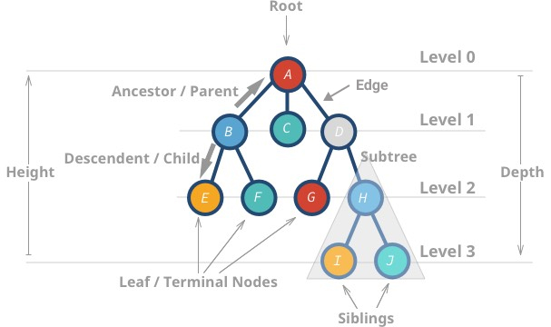
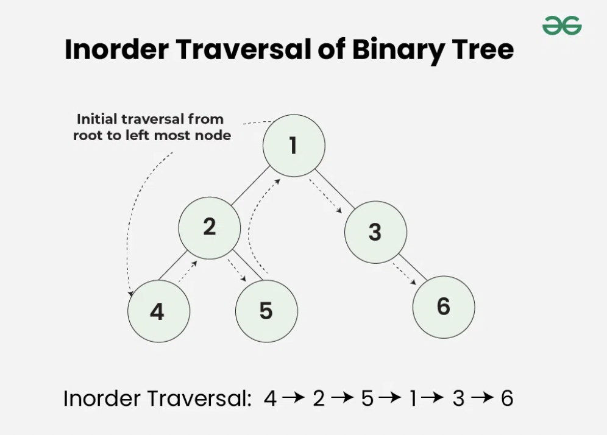

# Modul 4 - Tree

## **Daftar Isi**

- [Pengenalan Tree](#pengenalan-tree)
- [Binary Search Tree](#binary-search-tree)
- [Traversal Binary Search Tree](#traversal-binary-search-tree)
- [Self-Balancing Tree](#self-balancing-tree)
- [AVL Tree](#avl-tree)
- [AVL Tree (Revised)](#avl-tree-revised)

## **Pengenalan Tree**

### **Pengertian Struktur Data Tree**

Tree adalah salah satu bentuk struktur data non-linear yang hierarkis (hubungan one to many) antara kumpulan node yang saling terhubung.

Pada tree, setiap node dapat memiliki banyak child (tergantung jenis tree), tetapi harus terhubung ke tepat 1 parent.


> Sumber Gambar : https://commons.wikimedia.org/wiki/File:Tree_(computer_science).svg

### **Terminologi**



> Sumber Gambar : https://adrianmejia.com/images/tree-parts.jpg (dengan perubahan)

#### **Terminologi Dasar**

- **Root** - Node yang paling atas (node pertama) dari sebuah tree. Node root tidak memiliki parent.
- **Parent** - Node yang menjadi pendahulu suatu node.
- **Child** - Node yang menjadi penerus dari suatu node.
- **Siblings** - Node yang memilii parent yang sama.
- **Leaf** - Node yang tidak memiliki child.
- **Internal Nodes** - Semua node kecuali leaf dan root.
- **Subtree** - Setiap node beserta turunannya.

#### **Atribut Tree**

- **Edge** - Hubungan antara 2 node.
- **Depth of Node** - Jarak dari root ke node tertentu.
- **Height of Node** - Jarak dari leaf terjauh.
- **Height of Tree** - Jarak dari root ke leaf terjauh.

### **Binary Tree**

Binary tree merupakan struktur data tree yang setiap nodenya memiliki paling banyak 2 child.


> Sumber Gambar : https://commons.wikimedia.org/wiki/File:Complete_binary2.svg

## **Binary Search Tree**

### **Pengertian**

Binary Search Tree adalah struktur data pohon biner berbasis node yang memiliki properti sebagai berikut :

- Subtree kiri dari sebuah node hanya berisi node dengan data/key yang lebih kecil dari kunci node.
- Subtree kanan dari sebuah node hanya berisi node dengan data/key lebih besar dari kunci node.
- Subtree kiri dan kanan masing-masing juga harus berupa **binary search tree**.


> Sumber Gambar : https://courses.engr.illinois.edu/cs225/fa2022/assets/notes/bst/bsttreetraversal.png (dengan perubahan)

### **Implementasi Binary Search Tree**

#### **Properti**

**Node**

```cpp
struct BSTNode {
    BSTNode *left, *right;
    int key;
};
```

**Binary Search Tree**

```cpp
  struct BSTNode {
    BSTNode *_root;
    unsigned int _size;
};

// Fungsi-Fungsi...
```

#### Fungsi

**is_empty**

Untuk mengecek apakah BST kosong atau tidak

```cpp
bool isEmpty() {
    return _root == NULL;
}
```

**Find**

Berikut adalah cara melakukan pencarian node pada implementasi ini

1. Mulai dari root
2. Jika value yang dicari **lebih kecil** dari node yang sedang dicek, pindah **ke kiri**
3. Jika value yang dicari **lebih besar** dari node yang sedang dicek, pindah **ke kanan**


> Sumber gambar : https://courses.engr.illinois.edu/cs225/fa2022/assets/notes/bst/bstsearch.png

**Primary Function**

```cpp
bool find(int value) {
    BSTNode *temp = __search(_root, value);
    if (!temp)
        return false;
    if (temp->key == value)
        return true;
    else
        return false;
}
```

**Utility Function**

```cpp
BSTNode* __search(BSTNode *root, int value) {
    while (root != NULL) {
        if (value < root->key)
            root = root->left;

        else if (value > root->key)
            root = root->right;
        else
            return root;
    }
    return root;
}
```

**Insert**

Untuk menambahkan node, pertama-tama harus ditentukan dulu posisi node yang akan ditambahkan. Setelah mendapat posisi yang sesuai, maka akan dilakukan pembuatan node baru yang berisi value yang ingin ditambahkan. Node baru yang akan ditambahkan akan selalu berada di posisi daun (leaf).


**Primary Function**

```cpp
void insert(int value) {
    if (!find(value)) {
        _root = __insert(_root, value);
        _size++;
    }
}
```

**Utility Function**

```cpp
BSTNode* __insert(BSTNode *root, int value) {
    if (root == NULL)
        return __createNode(value);

    if (value < root->key)
        root->left = __insert(root->left, value);
    else if (value > root->key)
        root->right = __insert(root->right, value);

    return root;
}
```

**Remove**

Terdapat 3 kondisi pada saat akan remove.

**Kondisi 1** Node yang akan dihapus adalah node leaf (tanpa child)

Pada kondisi ini, node akan langsung dihapus


> Sumber gambar : https://courses.engr.illinois.edu/cs225/fa2022/assets/notes/bst/removeleaf.png

**Kondisi 2** Node yang akan dihapus mempunyai 1 child (kiri atau kanan)

Setelah node dihapus, maka child akan diposisikan pada node yang telah dihapus.


**Kondisi 3** Node yang akan dihapus mempunyai 2 child

Sebelum node dihapus, maka akan dilakukan pencarian node terkecil dari subTree kanan child, kemudian akan dilakukan pertukaran. Setelah itu, dilakukan penghapusan node.


**Primary Function**

```cpp
void remove(int value) {
    if (find(value)) {
        _root = __remove(_root, value);
        _size++;
    }
}
```

**Utility Function**

```cpp
BSTNode* __remove(BSTNode *root, int value) {
    if (root == NULL) return NULL;

    if (value > root->key)
        root->right = __remove(root->right, value);
    else if (value < root->key)
        root->left = __remove(root->left, value);
    else {

        if (root->left == NULL) {
            BSTNode *rightChild = root->right;
            free(root);
            return rightChild;
        }
        else if (root->right == NULL) {
            BSTNode *leftChild = root->left;
            free(root);
            return leftChild;
        }

        BSTNode *temp = __findMinNode(root->right);
        root->key     = temp->key;
        root->right   = __remove(root->right, temp->key);
    }
    return root;
}
```

```cpp
BSTNode* __findMinNode(BSTNode *node) {
    BSTNode *currNode = node;
    while (currNode && currNode->left != NULL)
        currNode = currNode->left;

    return currNode;
}
```

Contoh Code

### **Skewed Tree**

Jika urutan insertion tree yang dilakukan adalah 5,4,3,2,1 maka bentuk tree akan seperti gambar di bawah, dan ini dinamakan Skewed Tree


## **Traversal Binary Search Tree**

### Definisi

Traversal dalam struktur data mengacu pada **proses mengunjungi dan mengakses** setiap elemen dalam suatu struktur data, seperti array, linked list, tree, atau graph, setidaknya satu kali. Proses ini dilakukan secara sistematis dengan mengikuti urutan tertentu untuk menjalankan operasi seperti pencarian, pembaruan, atau menampilkan data. Dengan melakukan kunjungan secara lengkap, maka akan didapatkan urutan informasi secara linier yang tersimpan dalam sebuah binary tree.

### Traversal BST

Dalam konteks **Binary Search Tree (BST)**, traversal dilakukan dengan beberapa metode utama, yaitu:

1. **`Preorder Traversal`** (Root-Left-Right) → Kunjungi node akar terlebih dahulu, kemudian subtree kiri, lalu subtree kanan.


> Sumber : https://www.geeksforgeeks.org/tree-traversals-inorder-preorder-and-postorder/

#### Wrapper

```cpp
void traversePreorder() {
    __preorder(root);
    cout << endl;
}
```

#### Utility

```cpp
void __preorder(BSTNode* node) {
    if (node) {
        cout << node->key << " ";
        __preorder(node->left);
        __preorder(node->right);
    }
}
```

2. **`Inorder Traversal`** (Left-Root-Right) → Kunjungi subtree kiri terlebih dahulu, kemudian node akar, lalu subtree kanan. Dalam BST, traversal inorder menghasilkan elemen dalam urutan yang terurut.



> Sumber : https://www.geeksforgeeks.org/tree-traversals-inorder-preorder-and-postorder/

#### Wrapper

```cpp
void traverseInorder() {
    __inorder(root);
    cout << endl;
}
```

#### Utility

```cpp
void __inorder(BSTNode* node) {
    if (node) {
        __inorder(node->left);
        cout << node->key << " ";
        __inorder(node->right);
    }
}
```

3. **`Postorder Traversal`** (Left-Right-Root) → Kunjungi subtree kiri terlebih dahulu, kemudian subtree kanan, dan terakhir node akar.


> Sumber : https://www.geeksforgeeks.org/tree-traversals-inorder-preorder-and-postorder/

#### Wrapper

```cpp
void traversePostorder() {
    __postorder(root);
    cout << endl;
}

```

#### Utility

```cpp
void __postorder(BSTNode* node) {
    if (node) {
        __postorder(node->left);
        __postorder(node->right);
        cout << node->key << " ";
    }
}
```

### Contoh Implementasi

`Code`

```cpp
#include <iostream>
using namespace std;

// Struktur node untuk BST
struct BSTNode {
    int key;
    BSTNode* left;
    BSTNode* right;

    BSTNode(int value) {
        key = value;
        left = right = nullptr;
    }
};

// Struktur BST
struct BST {
    BSTNode* root;

    // Konstruktor
    BST() {
        root = nullptr;
    }

    // Fungsi untuk menyisipkan elemen
    void insert(int value) {
        root = __insert(root, value);
    }

    // Wrapper untuk Preorder Traversal
    void traversePreorder() {
        __preorder(root);
        cout << endl;
    }

    // Wrapper untuk Inorder Traversal
    void traverseInorder() {
        __inorder(root);
        cout << endl;
    }

    // Wrapper untuk Postorder Traversal
    void traversePostorder() {
        __postorder(root);
        cout << endl;
    }

private:
    // Utility Function untuk menyisipkan elemen ke BST
    BSTNode* __insert(BSTNode* node, int value) {
        if (node == nullptr)
            return new BSTNode(value);

        if (value < node->key)
            node->left = __insert(node->left, value);
        else
            node->right = __insert(node->right, value);

        return node;
    }

    // Utility Function untuk Preorder Traversal (Root - Left - Right)
    void __preorder(BSTNode* node) {
        if (node) {
            cout << node->key << " ";
            __preorder(node->left);
            __preorder(node->right);
        }
    }

    // Utility Function untuk Inorder Traversal (Left - Root - Right)
    void __inorder(BSTNode* node) {
        if (node) {
            __inorder(node->left);
            cout << node->key << " ";
            __inorder(node->right);
        }
    }

    // Utility Function untuk Postorder Traversal (Left - Right - Root)
    void __postorder(BSTNode* node) {
        if (node) {
            __postorder(node->left);
            __postorder(node->right);
            cout << node->key << " ";
        }
    }
};

int main() {
    BST tree;

    // Menambahkan elemen ke BST
    tree.insert(50);
    tree.insert(30);
    tree.insert(70);
    tree.insert(20);
    tree.insert(40);
    tree.insert(60);
    tree.insert(80);

    cout << "Preorder Traversal: ";
    tree.traversePreorder();

    cout << "Inorder Traversal: ";
    tree.traverseInorder();

    cout << "Postorder Traversal: ";
    tree.traversePostorder();

    return 0;
}

```

`contoh BST`

```
      50
     /  \
    30   70
   / \   / \
  20 40 60 80
```

`Output`

```cpp
Preorder Traversal: 50 30 20 40 70 60 80
Inorder Traversal: 20 30 40 50 60 70 80
Postorder Traversal: 20 40 30 60 80 70 50
```

### Referensi

Untuk mempermudah pemahaman BST dalam bentuk visual, kalian dapat menggunakan website ini [https://visualgo.net/en/bst]

> https://www.geeksforgeeks.org/tree-traversals-inorder-preorder-and-postorder/

## **Self-Balancing Tree**

## **AVL Tree**

## **AVL Tree (Revised)**
