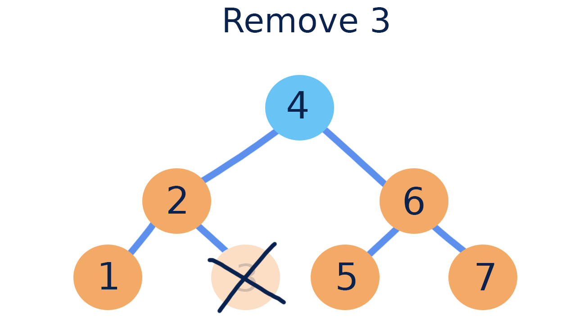
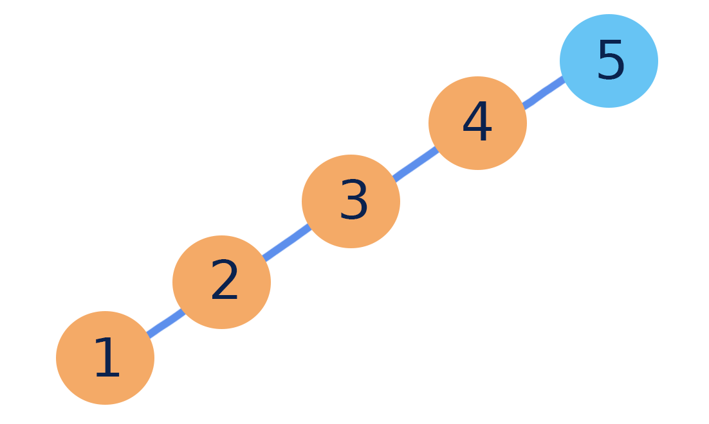
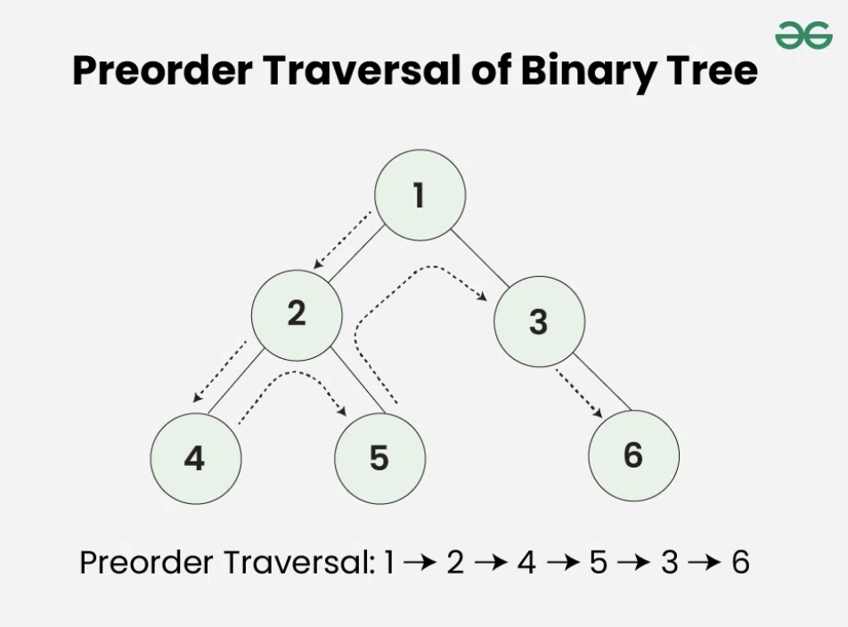

# Modul 4 - Tree

## **Daftar Isi**

- [Pengenalan Tree](#pengenalan-tree)
- [Binary Search Tree](#binary-search-tree)
- [Traversal Binary Search Tree](#traversal-binary-search-tree)
- [Self-Balancing Tree](#self-balancing-tree)
- [AVL Tree](#avl-tree)

## **Pengenalan Tree**

### **Pengertian Struktur Data Tree**

Tree adalah salah satu bentuk struktur data non-linear yang hierarkis (hubungan one to many) antara kumpulan node yang saling terhubung.

Pada tree, setiap node dapat memiliki banyak child (tergantung jenis tree), tetapi harus terhubung ke tepat 1 parent.


> Sumber Gambar : https://commons.wikimedia.org/wiki/File:Tree_(computer_science).svg

### **Terminologi**


> Sumber Gambar : https://adrianmejia.com/images/tree-parts.jpg (dengan perubahan)

#### **Terminologi Dasar**

- **Root** - Node yang paling atas (node pertama) dari sebuah tree. Node root tidak memiliki parent.
- **Parent** - Node yang menjadi pendahulu suatu node.
- **Child** - Node yang menjadi penerus dari suatu node.
- **Siblings** - Node yang memilii parent yang sama.
- **Leaf** - Node yang tidak memiliki child.
- **Internal Nodes** - Semua node kecuali leaf dan root.
- **Subtree** - Setiap node beserta turunannya.

#### **Atribut Tree**

- **Edge** - Hubungan antara 2 node.
- **Depth of Node** - Jarak dari root ke node tertentu.
- **Height of Node** - Jarak dari leaf terjauh.
- **Height of Tree** - Jarak dari root ke leaf terjauh.

### **Binary Tree**

Binary tree merupakan struktur data tree yang setiap nodenya memiliki paling banyak 2 child.


> Sumber Gambar : https://commons.wikimedia.org/wiki/File:Complete_binary2.svg

### **Referensi**

- https://en.wikipedia.org/wiki/Tree_(data_structure)
- https://www.geeksforgeeks.org/introduction-to-tree-data-structure/
- https://en.wikipedia.org/wiki/Binary_tree

- - -
## **Binary Search Tree**

### **Pengertian**

Binary Search Tree adalah struktur data pohon biner berbasis node yang memiliki properti sebagai berikut :

- Subtree kiri dari sebuah node hanya berisi node dengan data/key yang lebih kecil dari kunci node.
- Subtree kanan dari sebuah node hanya berisi node dengan data/key lebih besar dari kunci node.
- Subtree kiri dan kanan masing-masing juga harus berupa **binary search tree**.


> Sumber Gambar : https://courses.engr.illinois.edu/cs225/fa2022/assets/notes/bst/bsttreetraversal.png (dengan perubahan)

### **Implementasi Binary Search Tree**

[Kode Lengkap dapat dilihat di sini](/code/bst.cpp)

#### **Properti**

**Node**

```cpp
class BSTNode {
public:
    int key;
    BSTNode *left, *right;

    BSTNode(int value) {
        key = value;
        left = right = nullptr;
    }
};
```

**Class Binary Search Tree**

```cpp
class BST {
private:
    BSTNode* _root;
    unsigned int _size;

    // Utility functions lainnya ...

public:
    // Constructor
    BST() {
        _root = nullptr;
        _size = 0;
    }

    // Destructor
    ~BST() {
        __deleteTree(_root);
    }

    // Fungsi-fungsi ...
};
```

#### Fungsi

* **is_empty**

    Untuk mengecek apakah BST kosong atau tidak

    ```cpp
    bool isEmpty() {
        return _root == NULL;
    }
    ```

* **Find**

    Berikut adalah cara melakukan pencarian node pada implementasi ini

    1. Mulai dari root
    2. Jika value yang dicari **lebih kecil** dari node yang sedang dicek, pindah **ke kiri**
    3. Jika value yang dicari **lebih besar** dari node yang sedang dicek, pindah **ke kanan**

    

    > Sumber gambar : https://courses.engr.illinois.edu/cs225/fa2022/assets/notes/bst/bstsearch.png

    **Primary Function**

    ```cpp
    bool find(int value) {
        BSTNode *temp = __search(_root, value);
        if (!temp)
            return false;
        if (temp->key == value)
            return true;
        else
            return false;
    }
    ```

    **Utility Function**

    ```cpp
    BSTNode* __search(BSTNode *root, int value) {
        while (root != NULL) {
            if (value < root->key)
                root = root->left;

            else if (value > root->key)
                root = root->right;
            else
                return root;
        }
        return root;
    }
    ```

* **Insert**

    Untuk menambahkan node, pertama-tama harus ditentukan dulu posisi node yang akan ditambahkan. Setelah mendapat posisi yang sesuai, maka akan dilakukan pembuatan node baru yang berisi value yang ingin ditambahkan. Node baru yang akan ditambahkan akan selalu berada di posisi daun (leaf).

    

    **Primary Function**

    ```cpp
    void insert(int value) {
        if (!find(value)) 
        {
            _root = __insert(_root, value);
            _size++;
        }
    }
    ```

    **Utility Function**

    ```cpp
    BSTNode* __insert(BSTNode *root, int value) {
        if (root == NULL)
            return new BSTNode(value);

        if (value < root->key)
            root->left = __insert(root->left, value);
        else if (value > root->key)
            root->right = __insert(root->right, value);

        return root;
    }
    ```

* **Remove** \
    Terdapat 3 kondisi pada saat akan remove.

    - **Kondisi 1** Node yang akan dihapus adalah node leaf (tanpa child) \
        Pada kondisi ini, node akan langsung dihapus

        

        > Sumber gambar : https://courses.engr.illinois.edu/cs225/fa2022/assets/notes/bst/removeleaf.png

    - **Kondisi 2** Node yang akan dihapus mempunyai 1 child (kiri atau kanan) \
        Setelah node dihapus, maka child akan diposisikan pada node yang telah dihapus.

        

    - **Kondisi 3** Node yang akan dihapus mempunyai 2 child \
        Sebelum node dihapus, maka akan dilakukan pencarian node terkecil dari subTree kanan child, kemudian akan dilakukan pertukaran. Setelah itu, dilakukan penghapusan node.

        

    **Primary Function**

    ```cpp
    void remove(int value) {
        if (find(value)) 
        {
            _root = __remove(_root, value);
            _size++;
        }
    }
    ```

    **Utility Function**

    ```cpp
    BSTNode* __remove(BSTNode *root, int value) {
        if (root == NULL) return NULL;

        if (value > root->key)
            root->right = __remove(root->right, value);
        else if (value < root->key)
            root->left = __remove(root->left, value);
        else {

            if (root->left == NULL) {
                BSTNode *rightChild = root->right;
                free(root);
                return rightChild;
            }
            else if (root->right == NULL) {
                BSTNode *leftChild = root->left;
                free(root);
                return leftChild;
            }
            
            // Node with two children
            BSTNode *temp = __findMinNode(root->right);
            root->key     = temp->key;
            root->right   = __remove(root->right, temp->key);
        }
        return root;
    }
    ```

    ```cpp
    BSTNode* __findMinNode(BSTNode *node) {
        BSTNode *currNode = node;
        while (currNode && currNode->left != NULL)
            currNode = currNode->left;

        return currNode;
    }
    ```

### **Skewed Tree**

Jika urutan insertion tree yang dilakukan adalah 5,4,3,2,1 maka bentuk tree akan seperti gambar di bawah, dan ini dinamakan Skewed Tree



### **Referensi**

- https://www.geeksforgeeks.org/binary-search-tree-data-structure/
- https://courses.engr.illinois.edu/cs225/fa2022/resources/bst/

---
## **Traversal Binary Search Tree**

### Definisi

Traversal dalam struktur data mengacu pada **proses mengunjungi dan mengakses** setiap elemen dalam suatu struktur data, seperti array, linked list, tree, atau graph, setidaknya satu kali. Proses ini dilakukan secara sistematis dengan mengikuti urutan tertentu untuk menjalankan operasi seperti pencarian, pembaruan, atau menampilkan data. Dengan melakukan kunjungan secara lengkap, maka akan didapatkan urutan informasi secara linier yang tersimpan dalam sebuah binary tree.

### **Traversal BST**

Dalam konteks **Binary Search Tree (BST)**, traversal dilakukan dengan beberapa metode utama, yaitu:

1. **`Preorder Traversal`** (Root-Left-Right) → Kunjungi node akar terlebih dahulu, kemudian subtree kiri, lalu subtree kanan.



> Sumber : https://www.geeksforgeeks.org/tree-traversals-inorder-preorder-and-postorder/

#### Wrapper

```cpp
void traversePreorder() {
    __preorder(root);
    cout << endl;
}
```

#### Utility

```cpp
void __preorder(BSTNode* node) {
    if (node) {
        cout << node->key << " ";
        __preorder(node->left);
        __preorder(node->right);
    }
}
```

2. **`Inorder Traversal`** (Left-Root-Right) → Kunjungi subtree kiri terlebih dahulu, kemudian node akar, lalu subtree kanan. Dalam BST, traversal inorder menghasilkan elemen dalam urutan yang terurut.


> Sumber : https://www.geeksforgeeks.org/tree-traversals-inorder-preorder-and-postorder/

#### Wrapper

```cpp
void traverseInorder() {
    __inorder(root);
    cout << endl;
}
```

#### Utility

```cpp
void __inorder(BSTNode* node) {
    if (node) {
        __inorder(node->left);
        cout << node->key << " ";
        __inorder(node->right);
    }
}
```

3. **`Postorder Traversal`** (Left-Right-Root) → Kunjungi subtree kiri terlebih dahulu, kemudian subtree kanan, dan terakhir node akar.


> Sumber : https://www.geeksforgeeks.org/tree-traversals-inorder-preorder-and-postorder/

#### Wrapper

```cpp
void traversePostorder() {
    __postorder(root);
    cout << endl;
}

```

#### Utility

```cpp
void __postorder(BSTNode* node) {
    if (node) {
        __postorder(node->left);
        __postorder(node->right);
        cout << node->key << " ";
    }
}
```

### Contoh Implementasi

`Code`

```cpp
#include <iostream>

using namespace std;

// kelas untuk node pada BST
class BSTNode {
public:
    int key;
    BSTNode *left;
    BSTNode *right;

    BSTNode(int value) : key(value), left(nullptr), right(nullptr) {}
};

// kelas Binary Search Tree
class BST {
private:
    BSTNode *root;

    // fungsi rekursif untuk menyisipkan node
    BSTNode* insert(BSTNode *node, int value) {
        if (!node)
            return new BSTNode(value);
            
        if (value < node->key)
            node ->left = insert(node ->left, value);
        else
            node ->right = insert(node ->right, value);

        return node;
    }

    // fungsi rekursif untuk preorder traversal
    void preorder(BSTNode *node) {
        if (node) {
            cout << node ->key << " ";
            preorder(node ->left);
            preorder(node ->right);
        }
    }

    // fungsi rekursif untuk inorder traversal
    void inorder(BSTNode *node) {
        if (node) {
            inorder(node ->left);
            cout << node ->key << " ";
            inorder(node ->right);
        }
    }

    // fungsi rekursif untuk posstorder traversal
    void postorder(BSTNode *node) {
        if (node) {
            postorder(node ->left);
            postorder(node ->right);
            cout << node ->key << " ";
        }
    }

public:
    // constructor
    BST() : root(nullptr) {}

    // menyisipkan elemen ke dalam BST
    void insert(int value) {
        root = insert(root, value);
    }

    // traversal preorder
    void traversalPreorder() {
        preorder(root);
        cout << endl;
    }

    // traversal inorder
    void traversalInorder() {
        inorder(root);
        cout << endl;
    }

    // traversal Postorder
    void traversalPostorder() {
        postorder(root);
        cout << endl;
    }
};

int main() {
    BST tree;

    // menambahkan elemen ke BST
    tree.insert(50);
    tree.insert(30);
    tree.insert(70);
    tree.insert(20);
    tree.insert(40);
    tree.insert(60);
    tree.insert(80);

    cout << "Preorder Traversal: ";
    tree.traversalPreorder();

    cout << "Inorder Traversal: ";
    tree.traversalInorder();

    cout << "Postorder Traversal: ";
    tree.traversalPostorder();

    return 0;
}

```

`contoh BST`

```
      50
     /  \
    30   70
   / \   / \
  20 40 60 80
```

`Output`

```cpp
Preorder Traversal: 50 30 20 40 70 60 80
Inorder Traversal: 20 30 40 50 60 70 80
Postorder Traversal: 20 40 30 60 80 70 50
```

### Referensi

Untuk mempermudah pemahaman BST dalam bentuk visual, kalian dapat menggunakan website ini [https://visualgo.net/en/bst]

> https://www.geeksforgeeks.org/tree-traversals-inorder-preorder-and-postorder/

## **AVL Tree**

#### **Apa Bedanya BST dan AVL Tree?**

`BST (Binary Search Tree):`

> Tidak otomatis seimbang. Jika data dimasukkan berurutan, bisa jadi mirip seperti linked list.

`AVL Tree:`

> Merupakan BST self-balancing yang menggunakan rotasi untuk menjaga keseimbangan. Setelah operasi penyisipan atau penghapusan, AVL Tree memeriksa faktor keseimbangan dan melakukan rotasi jika diperlukan.

**Intinya:**
AVL Tree lebih optimal untuk data yang sering berubah, BST lebih sederhana tetapi berisiko tidak seimbang.

### **Self-Balancing Tree**

Self-Balancing Tree merupakan BST yang secara otomatis dapat menyeimbangkan perbedaan height saat terjadi insertion atau deletion pada node yang ada di BST tersebut. Dengan kata lain, Self-Balancing BST ini akan mempertahankan height sekecil mungkin untuk mempercepat operasi pada BST tersebut.

Height biasanya dipertahankan dalam urutan Log n sehingga semua operasi membutuhkan waktu rata-rata O(Log n).

### **Variasi Self-Balancing BST**

Terdapat beberapa jenis self-balancing tree, seperti Red-Black Tree, AVL Tree, dan Splay Tree. Pada modul ini akan dibahas lebih lanjut mengenai **AVL Tree**.

### **AVL Tree (Adelson-Velsky and Landis Tree)**

AVL tree merupakan sebuah self balanced BST dimana setiap nodenya mempertahankan perbedaan tinggi antara node kiri dan node kananya yang disebut balance factor. Nilai balance factor pada AVL **tidak boleh melebihi 1**.

### **Terminologi AVL Tree**

AVL memiliki terminology yang sama seperti pada modul sebelumnya, hanya terdapat beberapa tambahan terminology yang belum dibahas sebelumnya.

- Height : banyaknya tingkatan/level dalam suatu tree.
- Balance Factor : selisih antara height node kiri dengan node kanan
- Ancestor : seluruh node yang terletak diatas node dan memiliki jalur yang sama


Balance Factor merupakan hasil dari pengurangan height node child kiri dikurang height node child kanan. Dapat juga ditulis sebagai berikut :

$$BalanceFactor = HeightSubtreeKiri - HeightSubtreeKanan$$


> Sumber Gambar : https://static.javatpoint.com/ds/images/avl-tree.png

Dengan begitu, nilai valid Balance Factor hanya berikut ini

$BalanceFactor = HeightSubtreeKiri - HeightSubtreeKanan = -1, 0, 1$. Jika nilainya di luar angka-angka tersebut, maka _tree_ tersebut **imbalanced**

### **Representasi Node**

[Link Implementasi Lengkap `AVL Tree` dapat dilihat di sini >](https://github.com/AlproITS/StrukturData/blob/master/For%20C%2B%2B/AVL%20Tree/unique_AVL_tree.cpp)

Representasi node pada AVL Tree sama dengan BST hanya saja ada tambahan data berupa tinggi pada tiap nodenya.

```cpp
typedef struct AVLNode_t
{
    int data;
    struct AVLNode_t *left,*right;
    int height;
}AVLNode;

typedef struct AVL_t
{
    AVLNode *_root;
    unsigned int _size;
}AVL;
```

- Untuk menginisiasi sebuah AVl kita bisa menggunakan fungsi `avl_init()`.

```cpp
void avl_init(AVL *avl) {
    avl->_root = NULL;
    avl->_size = 0u;
}
```

- Variable height digunakan untuk mendapatkan balance factor dari suatu node.

```cpp
int _getHeight(AVLNode* node){
    if(node==NULL)
        return 0;
    return node->height;
}
```

### **Rotasi**

AVL sendiri akan **menyeimbangkan** dirinya dengan merotasi tree tersebut hingga tree tersebut menjadi balanced.

Terdapat 2 macam rotasi utama yang dipakai dalam avl yaitu Rotasi Right dan Rotasi Left. Untuk menentukan rotasi apa yang harus dilakukan maka pertama kita harus tahu balance factor dari tree tersebut dengan membandingkan selisih antara height subtree kiri dan height subtree kanan.

```cpp
int _getBalanceFactor(AVLNode* node){
    if(node==NULL)
        return 0;
    return _getHeight(node->left)-_getHeight(node->right);
}
```

Dari balance factor tersebut kita memiliki 4 kemunkinan kejadian:

1. Apabila Balance Factor > 1 / tinggi subtree kiri > tinggi subtree kanan :

- Apabila tinggi subtree kiri > subtree kanan **(Case left skewed)** -> **Rotasi Right/LL Cased**
- Apabila tinggi subtree kiri < subtree kanan **(Case left right zigzag)** -> **Rotasi Left Diikuti Rotasi Right**

2. Apabila Balance Factor < -1 / tinggi subtree kanan > tinggi subtree kiri :

- Apabila tinggi subtree kanan > subtree kiri **(Case right skewed)** -> **Rotasi Left/RR Cased**
- Apabila tinggi subtree kanan < subtree kiri **(Case right left zigzag)** -> **Rotasi Right Diikuti Rotasi Left**


Terdapat dua macam rotasi yang digunakan, yaitu rotasi kiri dan kanan.

- **Rotasi Kanan (Case Left-Skewed)**

```cpp
AVLNode* _rightRotate(AVLNode* pivotNode){

    AVLNode* newParrent=pivotNode->left;
    pivotNode->left=newParrent->right;
    newParrent->right=pivotNode;

    pivotNode->height=_max(_getHeight(pivotNode->left),
                    _getHeight(pivotNode->right))+1;
    newParrent->height=_max(_getHeight(newParrent->left),
                    _getHeight(newParrent->right))+1;

    return newParrent;
}
```

> **`pivotNode`** merupakan current Node kita yang akan kita jadikan patokan rotasi.

Untuk rotasi kanan caranya adalah child sebelah kiri dari pivotNode menjadi parent baru. Kemudian anak sebelah kanan dari parent baru akan menjadi left child dari pivotNode. Kemudian pivotNode akan menjadi right child dari parent baru. Kemudian lakukan update height untuk pivotNode dan newParrent node.


> Sumber Gambar : http://www.btechsmartclass.com/data_structures/ds_images/RR%20Rotation.png

**Right rotation** ini bisa menyelesaikan permasalahan untuk **Case Left Skewed**.

```c
AVLNode* _leftCaseRotate(AVLNode* node){
    return _rightRotate(node);
}
```

- **Rotasi Kiri (Case Right-Skewed)**

```cpp
AVLNode* _leftRotate(AVLNode* pivotNode){

    AVLNode* newParrent=pivotNode->right;
    pivotNode->right=newParrent->left;
    newParrent->left=pivotNode;

    pivotNode->height=_max(_getHeight(pivotNode->left),
                    _getHeight(pivotNode->right))+1;
    newParrent->height=_max(_getHeight(newParrent->left),
                    _getHeight(newParrent->right))+1;

    return newParrent;
}
```

Pada rotasi kiri caranya adalah right child dari pivotNode akan menjadi menjadi parent baru. Kemudian left child dari newParent akan menjadi right child pivotNode. Kemudian pivotNode akan menjadi right child dari parent baru. Kemudian lakukan update height untuk pivotNode dan newParrent node.


> Sumber Gambar : http://www.btechsmartclass.com/data_structures/ds_images/LL%20Rotation.png

**Left Rotation** ini bisa menyelesaikan permasalahan untuk **Case Right Skewed**.

```c
AVLNode* _rightCaseRotate(AVLNode* node){
    return _leftRotate(node);
}
```

- **Case Left-Right Zig-zag**

Case left right zigzag bisa diselesaikan menggunakan left rotation diikuti right rotation.

```cpp
AVLNode* _leftRightCaseRotate(AVLNode* node){
    node->left=_leftRotate(node->left);
    return _rightRotate(node);
}
```


> Sumber Gambar : http://www.btechsmartclass.com/data_structures/ds_images/LR%20Rotation.png

- **Case Right-Left Zig-zag**

```cpp
AVLNode* _rightLeftCaseRotate(AVLNode* node){
    node->right=_rightRotate(node->right);
    return _leftRotate(node);
}
```


> Sumber Gambar : http://www.btechsmartclass.com/data_structures/ds_images/RL%20Rotation.png

### **Search dan Insertion**

Dalam melakukan insert pada sebuah AVL kita perlu terlebih dahulu melakukan insert newnode standar seperti BST. Kemudian update nilai height setiap ancestor newnode. Untuk nilai height pada leaf adalah 1( nilai ini dipilih agar lebih mudah dalam menghandle empty node). Untuk setiap node selain leaf heightnya adalah nilai tertinggi diantara kedua childnya ditambah 1. Kemudian lakukan pengecekan terhadap balance factor setiap ancestor nodenya. Balance factor bisa didapat dari tinggi node kiri dikurangi tinggi node kanan. Jika ditemukan ada node yang tidak balance maka akan dilakukan rotasi.

- Fungsi Utilitas

`Untuk membuat sebuah node baru`

```cpp
// Fungsi untuk membuat sebuah node baru
AVLNode* _avl_createNode(int value) {
    // Alokasi memori untuk node baru
    AVLNode *newNode = (AVLNode*) malloc(sizeof(AVLNode));
    // Mengisi data node dengan nilai yang diberikan
    newNode->data = value;
    // Mengatur tinggi node menjadi 1
    newNode->height = 1;
    // Mengatur pointer ke anak kiri dan kanan menjadi NULL
    newNode->left = newNode->right = NULL;
    // Mengembalikan pointer ke node baru
    return newNode;
}
```

`Untuk melakukan pencarian node dengan nilai tertentu`

```cpp
// Fungsi untuk mencari sebuah node dengan nilai tertentu
AVLNode* _search(AVLNode *root, int value) {
    // Iterasi selama root tidak NULL
    while (root != NULL) {
        // Jika nilai lebih kecil, pergi ke anak kiri
        if (value < root->data)
            root = root->left;
        // Jika nilai lebih besar, pergi ke anak kanan
        else if (value > root->data)
            root = root->right;
        // Jika nilai sama, kembalikan node saat ini
        else
            return root;
    }
    // Jika node tidak ditemukan, kembalikan NULL
    return root;
}
```

`Untuk melakukan insert data dalam sebuah AVL`

```cpp
// Fungsi utilitas untuk melakukan insert data ke dalam sebuah AVL
AVLNode* _insert_AVL(AVL *avl, AVLNode* node, int value) {
    // Jika node NULL, buat node baru
    if (node == NULL)
        return _avl_createNode(value);
    // Jika nilai lebih kecil, masukkan ke subtree kiri
    if (value < node->data)
        node->left = _insert_AVL(avl, node->left, value);
    // Jika nilai lebih besar, masukkan ke subtree kanan
    else if (value > node->data)
        node->right = _insert_AVL(avl, node->right, value);

    // Update tinggi dari node saat ini
    node->height = 1 + _max(_getHeight(node->left), _getHeight(node->right));

    // Menghitung faktor keseimbangan untuk node saat ini
    int balanceFactor = _getBalanceFactor(node);

    // Memeriksa dan menyesuaikan keseimbangan jika diperlukan
    if (balanceFactor > 1 && value < node->left->data)
        return _leftCaseRotate(node);
    if (balanceFactor > 1 && value > node->left->data)
        return _leftRightCaseRotate(node);
    if (balanceFactor < -1 && value > node->right->data)
        return _rightCaseRotate(node);
    if (balanceFactor < -1 && value < node->right->data)
        return _rightLeftCaseRotate(node);

    // Mengembalikan node yang mungkin telah dirotasi
    return node;
}
```

- Fungsi Utama

`untuk mencari sebuah nilai`

```cpp
// Fungsi untuk mengecek apakah sebuah nilai ada dalam AVL atau tidak
bool avl_find(AVL *avl, int value) {
    // Mencari node dengan nilai yang diberikan
    AVLNode *temp = _search(avl->_root, value);
    // Jika node tidak ditemukan, kembalikan false
    if (temp == NULL)
        return false;

    // Jika nilai ditemukan, kembalikan true
    if (temp->data == value)
        return true;
    // Jika nilai tidak ditemukan, kembalikan false
    else
        return false;
}
```

`untuk memasukkan sebuah data`

```cpp
// Fungsi untuk memasukkan sebuah nilai ke dalam AVL
void avl_insert(AVL *avl, int value) {
    // Hanya memasukkan nilai jika belum ada dalam AVL
    if (!avl_find(avl, value)) {
        // Memanggil fungsi insert dan meng-update root
        avl->_root = _insert_AVL(avl, avl->_root, value);
        // Menambahkan ukuran AVL
        avl->_size++;
    }
}
```

### **Deletion**

Tidak jauh berbeda dengan melakukan insert pada AVL dalam melakukan remove pada sebuah AVL kita perlu terlebih dahulu melakukan remove standar seperti BST. Kemudian update nilai height setiap ancestor node. Kemudian lakukan pengecekan terhadap balance factor setiap ancestor nodenya. Jika ditemukan ada node yang tidak balance maka akan dilakukan rotasi.

- Fungsi Utilitas

`untuk mencari node dengan nilai terkecil dalam sebuah subtree`

```cpp
// Fungsi untuk mencari node dengan nilai terkecil dalam sebuah subtree
AVLNode* _findMinNode(AVLNode *node) {
    // Mengatur node awal untuk iterasi
    AVLNode *currNode = node;
    // Iterasi hingga menemukan node dengan nilai terkecil
    while (currNode && currNode->left != NULL)
        currNode = currNode->left;
    // Mengembalikan node dengan nilai terkecil
    return currNode;
}
```

`untuk menghapus sebuah node dari AVL`

```cpp
// Fungsi untuk menghapus sebuah node dari AVL
AVLNode* _remove_AVL(AVLNode* node, int value) {
    // Jika node NULL, kembalikan NULL
    if (node == NULL)
        return node;

    // Mencari node yang akan dihapus
    if (value > node->data)
        node->right = _remove_AVL(node->right, value);
    else if (value < node->data)
        node->left = _remove_AVL(node->left, value);
    else {
        // Node ditemukan
        AVLNode *temp;

        // Kasus dengan satu anak atau tanpa anak
        if ((node->left == NULL) || (node->right == NULL)) {
            temp = NULL;
            if (node->left == NULL) temp = node->right;
            else if (node->right == NULL) temp = node->left;

            if (temp == NULL) {
                temp = node;
                node = NULL;
            } else
                *node = *temp;

            free(temp);
        } else {
            // Kasus dengan dua anak
            // Cari node dengan nilai terkecil pada subtree kanan
            temp = _findMinNode(node->right);
            // Salin data
            node->data = temp->data;
            // Hapus node yang sudah disalin datanya
            node->right = _remove_AVL(node->right, temp->data);
        }
    }

    // Jika node NULL, kembalikan NULL
    if (node == NULL) return node;

    // Update tinggi node
    node->height = _max(_getHeight(node->left), _getHeight(node->right)) + 1;

    // Menghitung faktor keseimbangan
    int balanceFactor = _getBalanceFactor(node);

    // Lakukan rotasi untuk mempertahankan keseimbangan
    if (balanceFactor > 1 && _getBalanceFactor(node->left) >= 0)
        return _leftCaseRotate(node);

    if (balanceFactor > 1 && _getBalanceFactor(node->left) < 0)
        return _leftRightCaseRotate(node);

    if (balanceFactor < -1 && _getBalanceFactor(node->right) <= 0)
        return _rightCaseRotate(node);

    if (balanceFactor < -1 && _getBalanceFactor(node->right) > 0)
        return _rightLeftCaseRotate(node);

    // Mengembalikan node yang mungkin telah dirotasi
    return node;
}
```

- Fungsi Utama

`untuk menghapus sebuah nilai dari AVL`

```cpp
// Fungsi untuk menghapus sebuah nilai dari AVL
void avl_remove(AVL *avl, int value) {
    // Hanya menghapus jika nilai ditemukan dalam AVL
    if (avl_find(avl, value)) {
        // Memanggil fungsi penghapusan dan meng-update root
        avl->_root = _remove_AVL(avl->_root, value);
        // Mengurangi ukuran AVL
        avl->_size--;
    }
}
```

### **Referensi**

- https://en.wikipedia.org/wiki/Self-balancing_binary_search_tree
- https://www.geeksforgeeks.org/self-balancing-binary-search-trees-comparisons/
- https://github.com/lab-kcks/Modul-STRUKDAT/wiki/AVL-Tree-(Revised)
- http://www.btechsmartclass.com/data_structures/avl-trees.html
- https://github.com/AlproITS/StrukturData/wiki/Modul-3-(AVL-Tree)
